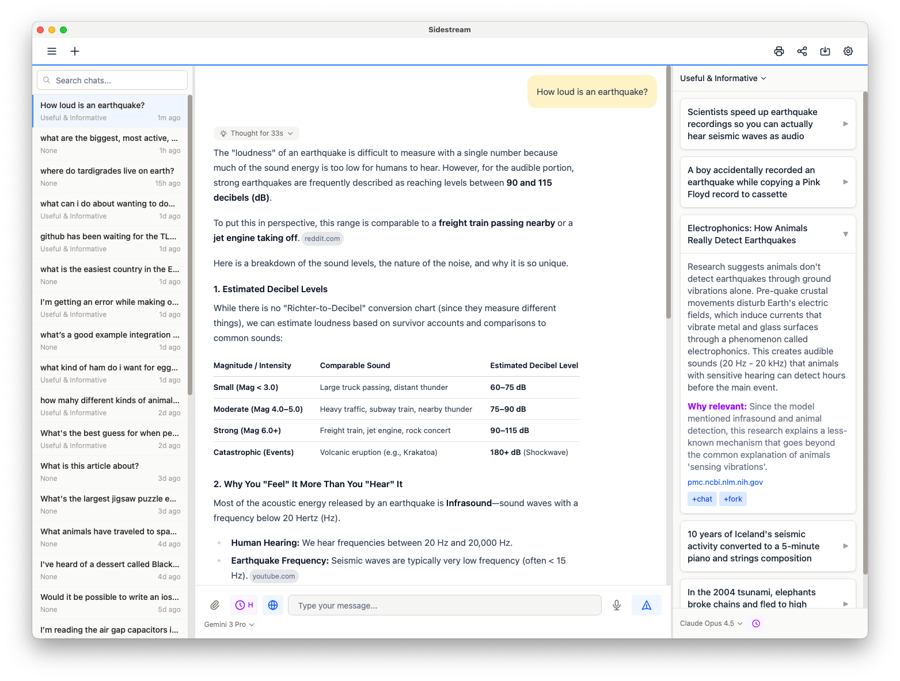

# Sidestream

**A free, open-source, cross-platform, cross-model AI chat app that adds useful, interesting, amusing, and critical information you wouldn't have known about otherwise.**

[](LICENSE)
[](https://sidestream-app.com)
[](https://sidestream-app.com)
[](https://sidestream-app.com)



## Why Sidestream?

Human conversation is more rewarding than talking with an AI because people aren't "helpful assistants".

- *They realize they know something you wouldn't even ask about, and eagerly tell you about it.*
- *They're reminded of something interesting or amusing, and steer the conversation in a more exciting direction.*
- *They realize that one of you misspoke, misremembered, made an incorrect assumption, or that you've been talking past each other - and they course correct the conversation.*

Sidestream does ALL of that and makes your conversations with AI way more useful and interesting than you've experienced before.

## What are "Discoveries"?

The discovery engine specifically looks for:

- Lesser-known but highly relevant information
- Content you wouldn't have asked for because you didn't know it existed
- Fascinating observations to steer the conversation in more exciting directions
- Contrasting and alternative views

NOT the obvious first-page Google results, Wikipedia summaries, or mainstream articles.

## Features

- **Six Discovery Modes** - Useful & Informative, Obscure & Interesting, Amusing & Entertaining, Lateral Thinking, Skeptical & Critical, Fact Checker
- **Bring Your Own API Keys** - Anthropic Claude, OpenAI ChatGPT, and/or Google Gemini. No subscriptions needed. Pay only for what you use. No usage limits.
- **Add Discoveries to Chat** - Incorporate insights into your main conversation with one click
- **Switch Models Mid-Chat** - Change models and even AI providers in the middle of a conversation
- **Voice Input** - Just talk if you don't feel like typing
- **Fork/Branch Chats** - Branch off into new directions from any point
- **Searchable Chat History** - Find past conversations easily
- **Export to HTML** - Share any chat as an easily shareable HTML file
- **Light and Dark Modes** - Choose your preferred theme
- **Cross-Platform** - Native apps for macOS, Windows, and Linux

## API Key FAQ

### What are API keys?

If you have an account with Anthropic, OpenAI, or Google Gemini you can get a code called an API key to use their AI services on a pay-as-you-go basis. They'll need a credit card so they can bill you for your AI usage. Your billing relationship is between you and the AI companies, not this app which is free.

### Where do I get API keys?

Once you have an account with these companies you can set up an API key at:

- **Anthropic** - [console.anthropic.com/settings/keys](https://console.anthropic.com/settings/keys)
- **OpenAI** - [platform.openai.com/settings/organization/api-keys](https://platform.openai.com/settings/organization/api-keys)
- **Google Gemini** - [aistudio.google.com/app/api-keys](https://aistudio.google.com/app/api-keys)

  If you receive a message from OpenAI/ChatGPT saying you have to "verify your organization" you can do it at [platform.openai.com/settings/organization/general](https://platform.openai.com/settings/organization/general)

### What are the benefits of an API key vs a subscription?

- With an API key you pay only for what you use. If you don't use AI this month, you pay nothing.
- With an API key there are no usage limits.
- You probably wouldn't want to subscribe to three different AI companies, but with API keys you can use the latest, best models from all three companies that free users don't have access to.
- You can mix and match - have a subscription to one or more AI company, but also have API keys for when you hit usage limits, or want to use a different company's models.

### What are the drawbacks of API keys?

- If you're a light user you'll probably save money with API keys vs. subscriptions, but if you're a moderate to heavy user API usage will end up being more expensive than a subscription.
- Additionally, this app uses more AI than a regular AI chat app because of the additional search & AI that happens in the discovery panel. So this app is not for the cost-conscious. It's for people who want the most useful & interesting AI chat experience.
- While this app has a lot of features, there are features such as persistent memory across chats, Anthropic "artifacts", and more that this app doesn't yet have. If those features are key to you, you may need to use the AI companies' own apps as well.

### Which API keys should I get?

- Because they don't cost anything if you don't use them, we recommend getting all three API keys because that gives you maximum flexibility and best results when using this app.
- If you want to get only one, we recommend Anthropic.

### How do I monitor my API usage spending?

- **Anthropic** - [console.anthropic.com/settings/cost](https://console.anthropic.com/settings/cost)
- **OpenAI** - [platform.openai.com/usage](https://platform.openai.com/usage)
- **Google** - [console.cloud.google.com/billing](https://console.cloud.google.com/billing/)

## About

Sidestream is a non-commercial, single-developer passion project motivated by a desire to bring a little more of the value, discovery, and pleasure of human conversation to our chats with AI.

## Privacy

API keys entered in the app are stored encrypted on your computer and only shared with the AI companies whose models you're using. The developer of this app has no access to your API keys, your chats, or any other information about you.

## Download

Get the latest version for your platform at **[sidestream-app.com/download](https://sidestream-app.com/download.html)**

## Building from Source

### Prerequisites

- [Node.js](https://nodejs.org/) (v18 or later)
- [Rust](https://rustup.rs/) (latest stable)
- Platform-specific dependencies:
  - **macOS**: Xcode Command Line Tools
  - **Windows**: [Visual Studio Build Tools](https://visualstudio.microsoft.com/visual-cpp-build-tools/)
  - **Linux**: `sudo apt install libwebkit2gtk-4.1-dev build-essential curl wget libssl-dev libgtk-3-dev libayatana-appindicator3-dev librsvg2-dev libasound2-dev`

### Build Steps

```bash
# Clone the repository
git clone https://github.com/ericbrandon/sidestream.git
cd sidestream

# Install dependencies
npm install

# Run in development mode
npm run tauri dev

# Build for production
npm run tauri build
```

The built application will be in `src-tauri/target/release/bundle/`.

## Contributing

Contributions are welcome! Please feel free to submit issues and pull requests.

1. Fork the repository
2. Create your feature branch (`git checkout -b feature/amazing-feature`)
3. Commit your changes (`git commit -m 'Add amazing feature'`)
4. Push to the branch (`git push origin feature/amazing-feature`)
5. Open a Pull Request

## License

This project is licensed under the MIT License - see the [LICENSE](LICENSE) file for details.

## Links

- **Website**: [sidestream-app.com](https://sidestream-app.com)
- **Issues**: [GitHub Issues](https://github.com/ericbrandon/sidestream/issues)
- **Author**: Eric Brandon (ebrandon.developer@gmail.com)
